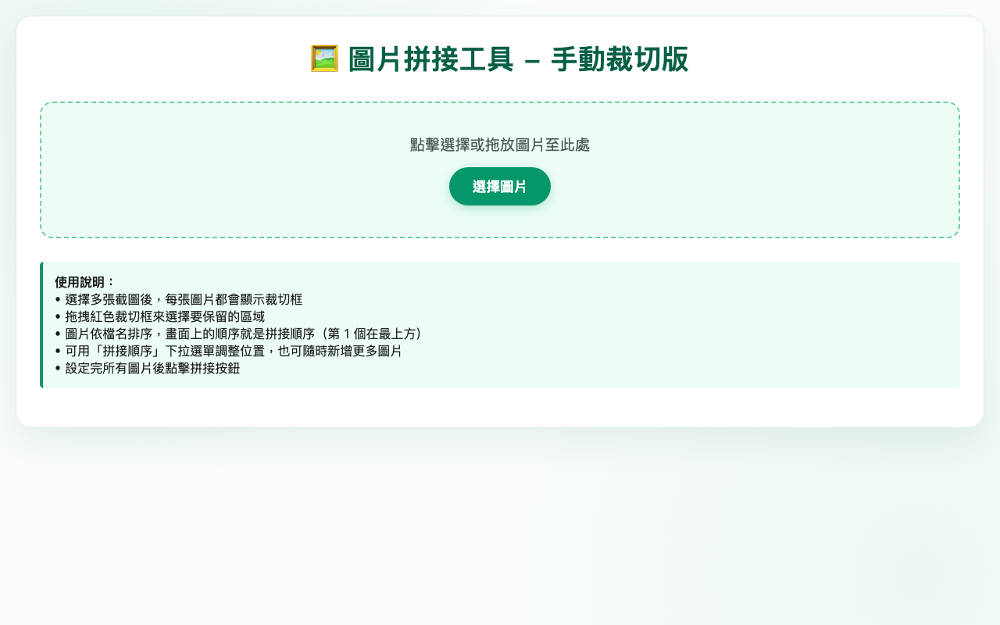

# 圖片拼接工具 使用說明

## 這是什麼？
將多張圖片上下拼接成一張長圖，可手動裁切每張圖片要保留的區域。

## 使用方式
1. 點擊「選擇圖片」或拖放多張圖片
2. 每張圖片會顯示紅色裁切框，拖曳調整要保留的區域
3. 用「拼接順序」下拉選單調整圖片順序
4. 設定完成後點擊「拼接」按鈕
5. 下載拼接後的長圖

## 功能特色
- 手動裁切每張圖片的保留區域
- 可隨時新增更多圖片
- 拖曳調整拼接順序
- PWA 支援離線使用
- 純前端處理，圖片不上傳

## 注意事項
- 圖片依檔名排序，畫面上第 1 個在最上方
- 過大的圖片會自動縮放以避免記憶體不足
